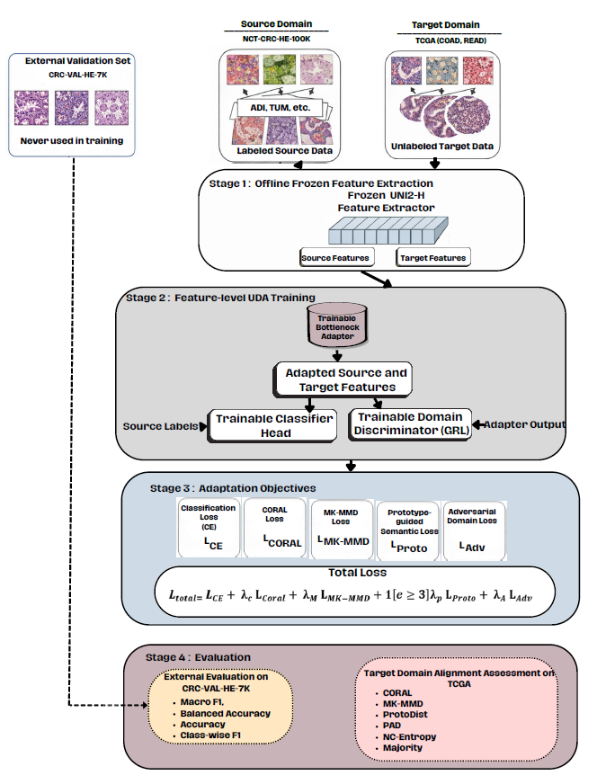
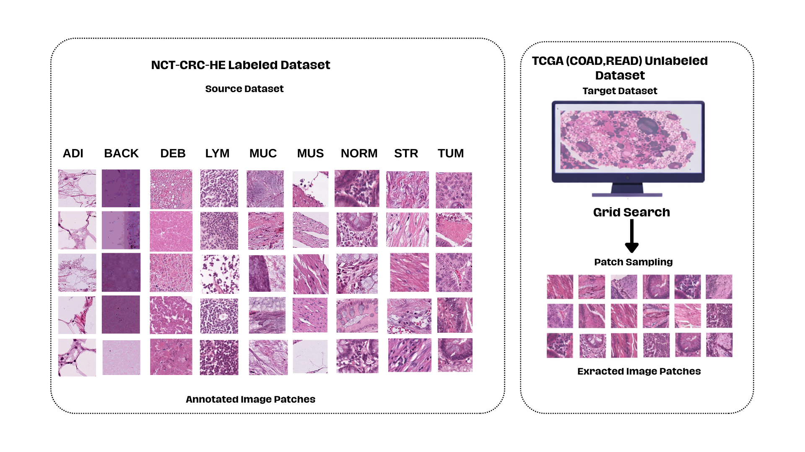

# TriAlign-UDA

### Hybrid Domain Adaptation for Histopathology Foundation Model Features

TriAlign-UDA is a **hybrid feature-level Unsupervised Domain Adaptation (UDA) framework developed for histopathology foundation model features**.

The method is designed to address the **domain shift problem** caused by differences in staining protocols, scanner conditions, tissue preparation workflows, and data collection settings across datasets.

TriAlign-UDA has been specifically evaluated for **colorectal cancer histopathology** and performs adaptation between the following domains:

- **Source Domain:** NCT-CRC-HE-100K
- **Target Domain:** TCGA-COAD / TCGA-READ
- **External Evaluation Set:** CRC-VAL-HE-7K

The framework addresses cross-domain generalization by jointly optimizing:

- **source-domain class discriminability**
- **statistical distribution alignment**
- **prototype-based semantic preservation**
- **adversarial domain alignment**

---

# Architectural Overview

<p align="center">
  
</p>

TriAlign-UDA operates on **frozen histopathology foundation model representations** and consists of three main stages/components:

A concise reference implementation is provided in [`notebooks/TriAlign_UDA.ipynb`](notebooks/TriAlign_UDA.ipynb).


### 1. Frozen Feature Backbone

The model uses a **pretrained UNI2-H encoder** as the feature extractor.

The backbone:

- is completely frozen
- produces fixed **1536-dimensional patch-level feature representations**
- is not updated during domain adaptation
- preserves general histopathological representation capacity

All source, target, and evaluation patches are first converted into feature vectors using the frozen UNI2-H encoder. The adaptation stage is then performed **only at the feature level**.

---

### 2. Trainable Feature Adapter

The core adaptation module is a **bottleneck residual adapter** that transforms frozen features in a parameter-efficient manner.

Its structure is:

```text
1536 → 96 → 1536
```

For an input feature vector `x`, the adapted representation is defined as:

```text
z = x + A(x)
```

where `A(x)` denotes the adapter transformation.

The adapter:

- learns a limited residual correction on frozen features
- reduces domain shift between source and target domains
- creates a shared feature space
- avoids retraining the large foundation model encoder

---

### 3. Classification and Domain Alignment Heads

The adapted feature representation is passed to two trainable heads:

#### Classification Head

The classifier is trained **only using labeled source-domain data**.

This head:

- preserves class discriminability
- provides supervised learning during adaptation
- performs **nine-class tissue classification**

#### Domain Discriminator (GRL)

TriAlign-UDA also includes a **domain discriminator with a Gradient Reversal Layer (GRL)**.

This component:

- distinguishes source and target features
- encourages domain-invariant feature learning through adversarial training
- uses only source/target domain labels
- does **not** use target-domain tissue labels or pseudo-labels

---

# Datasets

TriAlign-UDA performs feature-level domain adaptation between colorectal histopathology datasets.

<p align="center">
  
</p>

## Source Domain

**NCT-CRC-HE-100K**

The labeled source domain consists of 9 histopathological tissue classes:

| Abbreviation | Description |
|---|---|
| ADI | Adipose Tissue |
| BACK | Background |
| DEB | Debris |
| LYM | Lymphocytes |
| MUC | Mucus |
| MUS | Smooth Muscle |
| NORM | Normal Colon Mucosa |
| STR | Stroma |
| TUM | Tumor Epithelium |

The source dataset is stratified into:

- **Source training split:** 90%
- **Source validation split:** 10%

The **source validation split** is used only for **checkpoint selection** based on **Macro-F1**.

---

## Target Domain

**TCGA-COAD / TCGA-READ**

The target domain is derived from colorectal cancer whole-slide images obtained from TCGA.

The target domain:

- consists of histopathology whole-slide image patches
- is treated as **completely unlabeled**
- does **not** use class labels during training
- does **not** use pseudo-labels
- is used only for unsupervised feature-level alignment

To preserve comparability across experiments, a fixed subset of **10,000 target patches** is used during adaptation.

---

## External Evaluation Set

**CRC-VAL-HE-7K**

CRC-VAL-HE-7K is used as an **independent external evaluation dataset**.

It is kept completely separate from:

- training
- domain adaptation
- hyperparameter selection
- checkpoint selection

This dataset is used **only for final external evaluation**.

---

# Multi-Term Alignment Strategy of TriAlign-UDA

TriAlign-UDA employs a **hybrid feature-level adaptation objective** that combines complementary alignment mechanisms.

The total loss is defined as:

```text
L_total(e) =
L_CE
+ λc(e) * L_CORAL
+ λm(e) * L_MK-MMD
+ 1[e ≥ 3] * λp * L_Proto
+ λa(e) * L_Adv
```

These terms provide:

- **source-supervised classification**
- **covariance-based statistical alignment**
- **kernel-based distribution alignment**
- **prototype-based semantic preservation**
- **adversarial domain alignment**

The auxiliary alignment terms are gradually introduced using early ramp-up scheduling to prevent them from overwhelming the supervised source-domain learning signal at the beginning of training.

---

## Cross Entropy

Cross Entropy provides **supervised classification learning** on labeled source-domain samples.

This loss:

- is computed only on source data
- preserves tissue class discrimination
- trains the classifier head

---

## CORAL

**CORAL (Correlation Alignment)** aligns the **second-order statistics** of source and target feature distributions.

It reduces the discrepancy between the covariance matrices of adapted source and target features, helping to minimize statistical domain shift.

---

## MK-MMD

**MK-MMD (Multiple Kernel Maximum Mean Discrepancy)** is a kernel-based distribution alignment loss.

It aligns source and target feature distributions using multiple Gaussian kernel scales:

```text
σ = {1, 2, 4, 8, 16}
```

This component helps reduce global distribution mismatch in the shared feature space.

---

## Prototype-based Semantic Regularization

To preserve semantic class structure, TriAlign-UDA uses **source-domain class prototypes**.

This component:

- computes class prototypes from adapted source features
- encourages source samples to remain close to their own class centers
- supports semantic consistency during adaptation
- helps preserve class-discriminative structure

The prototype-based loss is activated starting from the **third epoch**, since prototype estimates may be unstable during the earliest training stage.

---

## Adversarial Domain Alignment

TriAlign-UDA incorporates adversarial adaptation through a **Gradient Reversal Layer (GRL)** and a domain discriminator.

This component:

- reduces source-target domain separability
- promotes domain-invariant representations
- does not require target labels
- complements statistical and semantic alignment objectives

---

# Training and Evaluation Protocol

TriAlign-UDA is trained under a fixed experimental protocol:

- **Foundation model:** UNI2-H (frozen)
- **Feature dimension:** 1536
- **Target subset:** 10,000 unlabeled TCGA patches
- **Epochs:** 5
- **Seeds:** 5 random seeds (`0–4`)
- **Optimizer:** AdamW
- **Learning rate:** `5 × 10^-4`
- **Weight decay:** `1 × 10^-4`
- **Batch size:** 64
- **Gradient clipping:** 1.0
- **Final TriAlign-UDA coefficients:** CORAL `0.05`, MK-MMD `0.05`, prototype `0.10`, adversarial `0.05`
- **Prototype activation:** epoch 3
- **Alignment/GRL ramp:** linear ramp during the first 2 epochs

The **best checkpoint** is selected **only using Macro-F1 on the source validation split**.

The **CRC-VAL-HE-7K dataset is never used** during training, adaptation, hyperparameter tuning, or checkpoint selection.

---

# Baseline Methods

TriAlign-UDA is compared with the following baselines:

| Method | Description |
|---|---|
| SourceOnly | Source-supervised classifier without target alignment |
| DeepCORAL | Source classification with CORAL-based statistical alignment |
| DAN | Source classification with MK-MMD-based distribution alignment |
| DANN | Domain-adversarial neural network with GRL |
| EUDA | Frozen-feature bottleneck adaptation with MMD-based alignment |
| PLADA-f | Feature-level adversarial alignment with prototype/category-level adaptation |
| TriAlign-UDA | Hybrid statistical, semantic, and adversarial feature-level adaptation |

All methods use:

- the same frozen UNI2-H input features
- the same source training/validation split
- the same fixed 10,000-sample unlabeled TCGA target subset
- the same five random seeds
- the same external evaluation protocol

Method-specific adaptation structures are retained for EUDA and PLADA-f rather than forcing all baselines into the TriAlign-UDA architecture.

---

# Experimental Evaluation

Classification performance is evaluated on **CRC-VAL-HE-7K** using:

- **Accuracy**
- **Balanced Accuracy**
- **Macro-F1**
- **Class-wise F1**

Target-domain alignment quality is also analyzed on the unlabeled TCGA target subset using:

- **CORAL**
- **MK-MMD**
- **ProtoDist**
- **Proxy A-Distance (PAD)**
- **Neighborhood Consistency Entropy (NC-Entropy)**
- **Majority**

These metrics provide complementary evidence about adaptation behavior in frozen feature space.

---

# External Classification Results

Final external classification results on **CRC-VAL-HE-7K** are reported as **mean ± standard deviation over five seeds**.

| Method | Accuracy ↑ | Balanced Accuracy ↑ | Macro-F1 ↑ |
|---|---:|---:|---:|
| SourceOnly | 0.9560 ± 0.0158 | 0.9448 ± 0.0145 | 0.9404 ± 0.0157 |
| DeepCORAL | 0.9283 ± 0.0165 | 0.9250 ± 0.0116 | 0.9160 ± 0.0139 |
| DAN | 0.9544 ± 0.0071 | 0.9432 ± 0.0042 | 0.9391 ± 0.0063 |
| DANN | 0.9640 ± 0.0070 | 0.9545 ± 0.0034 | 0.9488 ± 0.0058 |
| EUDA | 0.9640 ± 0.0049 | 0.9539 ± 0.0056 | 0.9493 ± 0.0062 |
| PLADA-f | 0.9531 ± 0.0136 | 0.9300 ± 0.0277 | 0.9251 ± 0.0263 |
| TriAlign-UDA | **0.9669 ± 0.0050** | **0.9560 ± 0.0063** | **0.9515 ± 0.0067** |

TriAlign-UDA achieves the **highest mean Accuracy, Balanced Accuracy, and Macro-F1** among the compared methods on the independent external evaluation set.

DANN and EUDA provide the closest external classification results. Paired tests show that the differences between TriAlign-UDA and DANN, EUDA, or PLADA-f do not reach statistical significance; TriAlign-UDA is therefore not positioned as statistically superior to these strong baselines.

---

# Ablation Study

To analyze the contribution of individual components, the following ablation settings are evaluated:

| Variant | CE | CORAL | MK-MMD | Proto | Adv |
|---|---|---|---|---|---|
| B0 | ✓ | × | × | × | × |
| B1 | ✓ | ✓ | × | × | × |
| B2 | ✓ | ✓ | ✓ | × | × |
| B3 | ✓ | ✓ | ✓ | ✓ | × |
| TriAlign-UDA | ✓ | ✓ | ✓ | ✓ | ✓ |

The ablation results show that:

- adding alignment terms does **not always produce monotonic improvement**
- the **full TriAlign-UDA configuration** provides the best mean external classification performance
- the final performance gain emerges from the **balanced combination** of statistical alignment, prototype-based semantic preservation, and adversarial domain alignment

The sequential ablations follow the same fixed manuscript weights where the corresponding components are active: B0 uses cross-entropy only, B1 adds CORAL, B2 adds MK-MMD, B3 adds prototype-based semantic regularization, and the full TriAlign-UDA configuration adds adversarial domain alignment.

---

# Target-Domain Alignment Analysis

Target-domain alignment quality is evaluated on the unlabeled TCGA subset using feature-level proxy metrics.

These analyses show that:

- strong proxy alignment does **not always guarantee** the best external classification performance
- external validation performance should be considered alongside target-domain alignment metrics
- TriAlign-UDA is designed to balance domain alignment and preservation of class-discriminative structure

This perspective is particularly important in histopathology, where aggressive alignment may reduce domain discrepancy while still harming tissue-level discrimination.

---

# Related Publication

This work is described in detail in the following paper:

**TriAlign UDA: Hybrid Domain Adaptation for Histopathology Foundation Model Features**

📄 *Currently under review*

```bibtex
@article{trialign2026,
  title={TriAlign UDA: Hybrid Domain Adaptation for Histopathology Foundation Model Features},
  author={Ozkan, Merve and Ozcan, Caner},
  journal={Scientific Reports},
  year={2026}
}
```

---

# Funding

This research was supported by the **Scientific and Technological Research Council of Türkiye (TÜBİTAK)** under the **1002-A Short-Term Support Module** (grant **125E868**).

---

# Data Availability

The datasets used in this study are publicly available:

- **NCT-CRC-HE-100K / CRC-VAL-HE-7K:** https://zenodo.org/record/1214456
- **TCGA-COAD / TCGA-READ:** https://portal.gdc.cancer.gov/

No new patient-level clinical data were generated in this study.

---

# Acknowledgements

This work makes use of the following public datasets:

- **NCT-CRC-HE-100K**
- **CRC-VAL-HE-7K**
- **TCGA-COAD**
- **TCGA-READ**

We thank the original dataset providers for making these histopathological datasets publicly available.

The TCGA-COAD/READ whole-slide images used in this study were obtained from data generated by the **TCGA Research Network**.
