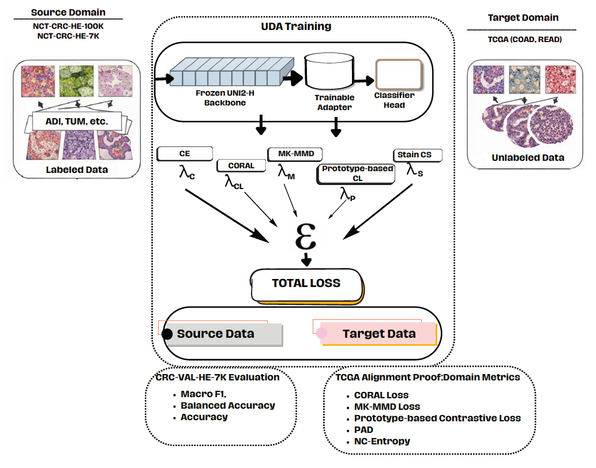
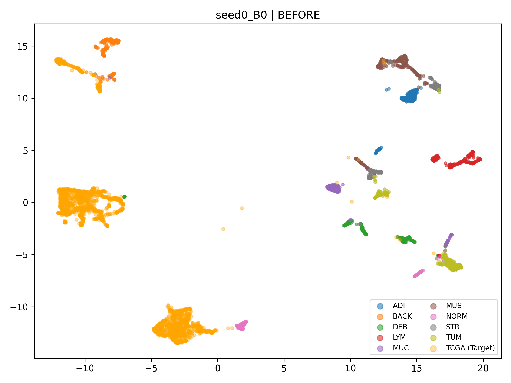
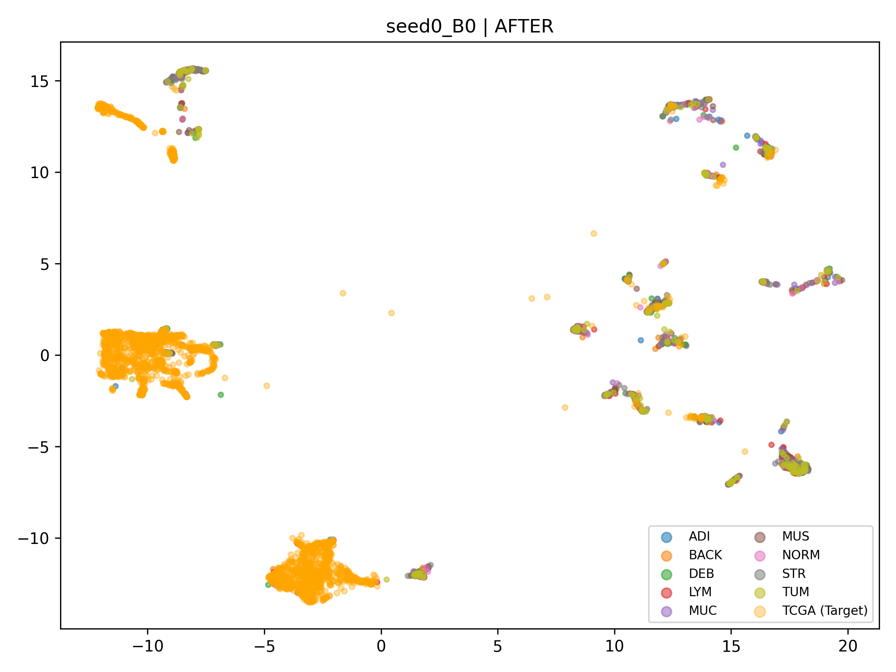
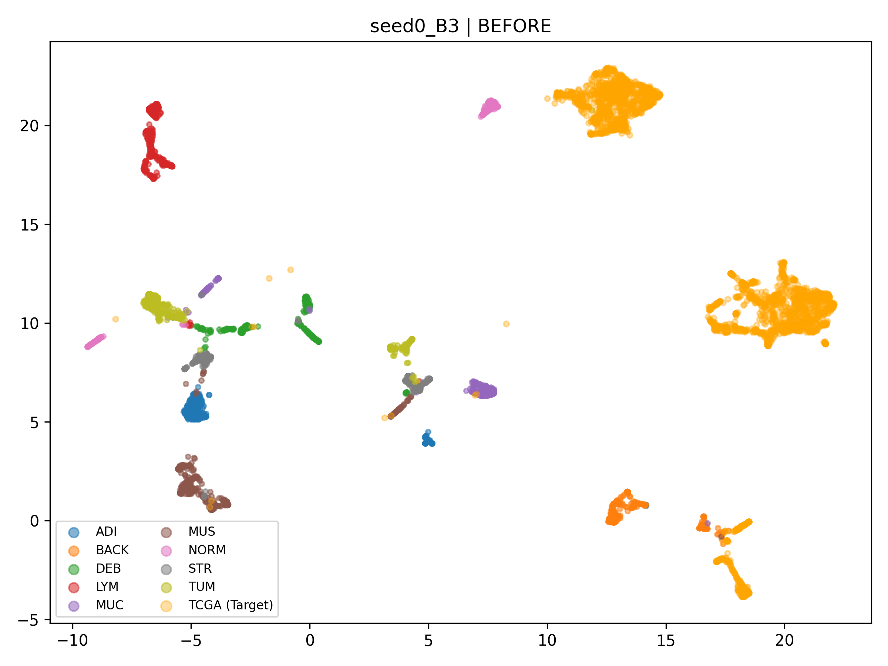
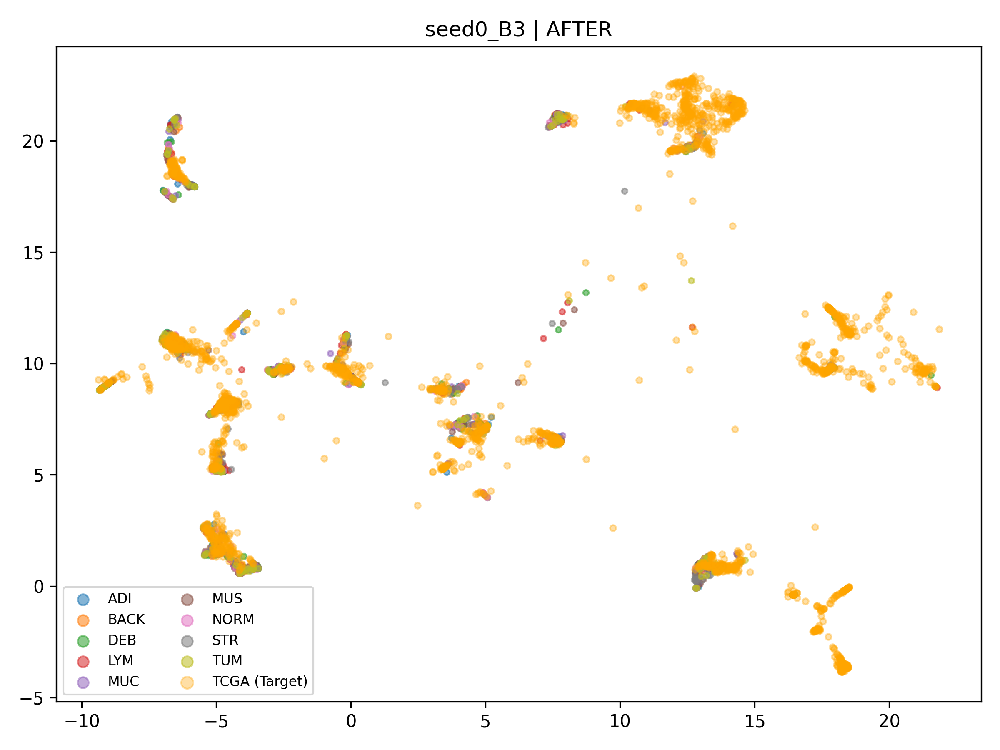

# TriAlign-UDA
### Multi-Term Statistical and Semantic Alignment for Unsupervised Domain Adaptation in Colon Histopathology

TriAlign-UDA is a **multi-term feature alignment based Unsupervised Domain Adaptation (UDA) approach developed for histopathological images**.

The method is designed to address the **domain shift problem** that occurs between different datasets and has been specifically evaluated on **colorectal cancer histopathology**.

TriAlign-UDA performs adaptation between the following datasets:

- **Source Domain:** NCT-CRC-HE
- **Target Domain:** TCGA (COAD, READ)

The method improves cross-domain generalization by simultaneously optimizing **class discriminability**, **statistical distribution alignment**, and **semantic prototype consistency**.

---

# Architectural Overview

<p align="center">

</p>

TriAlign-UDA consists of three main components:

### 1. Frozen Feature Backbone

The model uses a **pretrained UNI2-H encoder**.

The backbone:

- is frozen
- preserves general histopathological representations
- is not updated during domain adaptation

---

### 2. Trainable Feature Adapter

The adapter layer is the core component where domain adaptation occurs.

Its responsibilities include:

- reducing domain shift
- creating a shared feature space
- aligning target domain features with the source domain

---

### 3. Classification Head

The classifier is trained **using labeled source domain data**.

This layer:

- preserves class discriminability
- provides supervised learning during adaptation

---

# Datasets

TriAlign-UDA performs domain adaptation between two histopathology datasets.

<p align="center">

</p>

## Source Domain

**NCT-CRC-HE**

Contains 9 histopathological tissue classes:

| Abbreviation | Description |
|---|---|
ADI | Adipose Tissue
BACK | Background
DEB | Debris
LYM | Lymphocytes
MUC | Mucus
MUS | Smooth Muscle
NORM | Normal Colon Mucosa
STR | Stroma
TUM | Tumor Epithelium

The following subsets are used:

- **NCT-CRC-HE-100K**
- **CRC-VAL-HE-7K**

---

## Target Domain

**TCGA (COAD, READ)**

- consists of whole slide histopathology images
- **labels are not used during training**
- grid-based patch extraction is applied

---

# Multi-Term Alignment Strategy of TriAlign-UDA

TriAlign-UDA employs an optimization strategy that combines five different loss functions.

The total loss function is defined as:

```
L_total =
λc  * CrossEntropy
+ λcl * CORAL
+ λm  * MK-MMD
+ λp  * Prototype Contrastive
+ λs  * Stain Consistency
```

These losses provide complementary alignment mechanisms.

---

## Cross Entropy

Provides **supervised classification learning** on the source domain.

---

## CORAL (Correlation Alignment)

Aligns the **covariance matrices** of source and target domain features.

---

## MK-MMD (Multiple Kernel Maximum Mean Discrepancy)

A kernel-based distribution alignment method.

It attempts to **match the feature distributions between domains**.

---

## Prototype-based Contrastive Learning

Semantic consistency is maintained using **class prototypes**.

This approach:

- strengthens class clustering
- preserves cross-domain semantic structure

---

## Stain Consistency Loss

Histopathology images often contain **staining variations**.

This loss:

- reduces color variation
- stabilizes domain adaptation

---

# Feature Space Visualization

To analyze the effect of TriAlign-UDA on domain adaptation, **UMAP visualization** is used.

---

# Baseline Model (B0)

### Before Adaptation

<p align="center">

</p>

### After Adaptation

<p align="center">

</p>

In the baseline model, domain separation is still clearly observable.

---

# TriAlign Adaptation (B3)

### Before Adaptation

<p align="center">

</p>

### After Adaptation

<p align="center">

</p>

After TriAlign-UDA:

- domain separation significantly decreases
- class clustering improves
- cross-domain feature space alignment emerges

---

# Experimental Evaluation

Model performance is evaluated using the following metrics:

- **Macro F1 Score**
- **Balanced Accuracy**
- **Accuracy**

Additionally, domain alignment quality is analyzed using:

- CORAL Loss
- MK-MMD Loss
- Prototype Contrastive Loss
- Proxy A-Distance
- Neighborhood Consistency Entropy

These metrics provide quantitative evidence of domain adaptation effectiveness.

---

# Ablation Study

To analyze the contribution of TriAlign-UDA components, the following experimental configurations are evaluated.

| Model | Components |
|---|---|
B0 | Base classifier
B1 | + CORAL
B2 | + MK-MMD
B3 | + Prototype Contrastive
B4 | + Stain Consistency

The ablation results demonstrate that each component contributes positively to adaptation performance.

---

# Related Publication

This work is described in detail in the following paper.

**TriAlign-UDA: Multi-Term Feature Alignment for Unsupervised Domain Adaptation in Histopathology**

📄 *Currently under review*

```
@article{trialign2026,
title={TriAlign-UDA: Multi-Term Feature Alignment for Unsupervised Domain Adaptation in Histopathology},
author={Anonymous},
journal={Under Review},
year={2026}
}
```

---

# Acknowledgements

This work makes use of the following public datasets:

- NCT-CRC-HE Dataset
- TCGA COAD / READ

We thank the original dataset providers.
